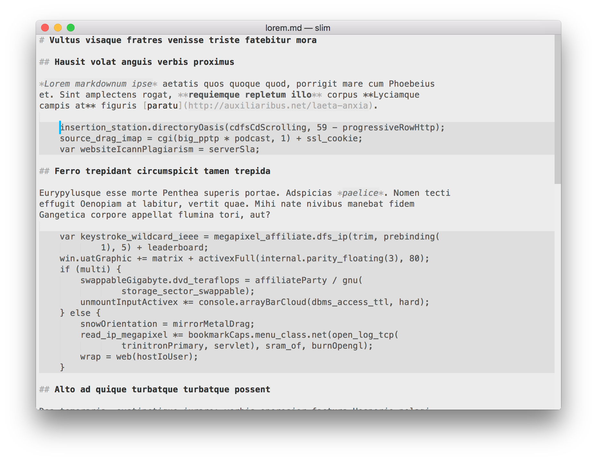

Commands
--------
* Toggle View disables/enables line numbers and gutter
* Toggle Window disables/enables menu, sidebar, tabs bar, status bar and minimap
* Focus disables all items for both the current window and view
* Unfocus reverts the current window and view to its previous settings 

**Editing a markdown file with a focused window:**

